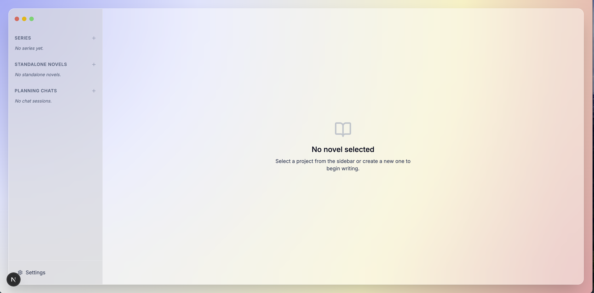
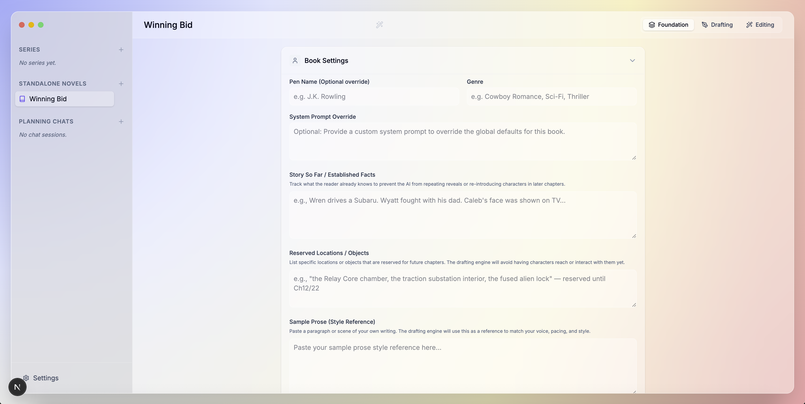
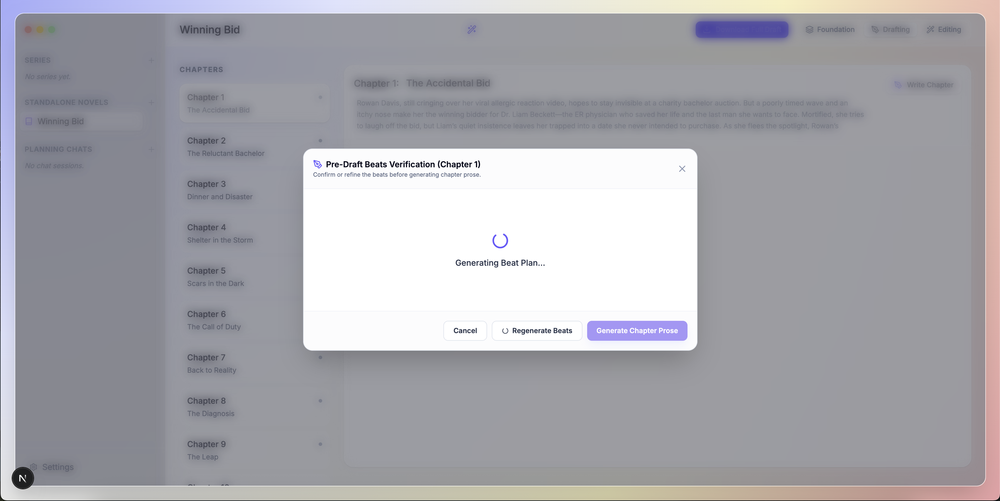
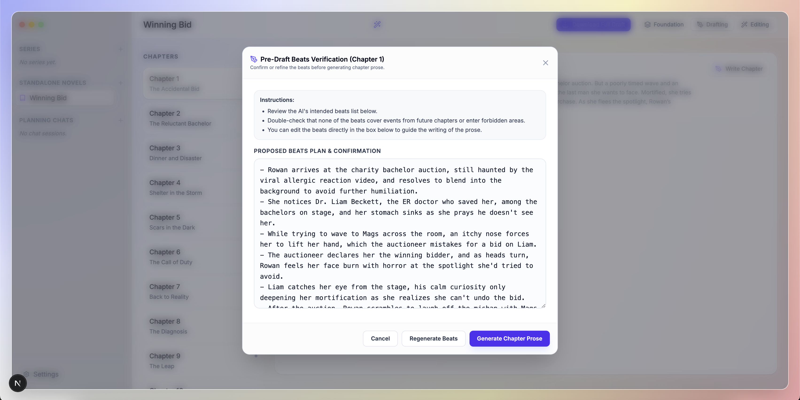
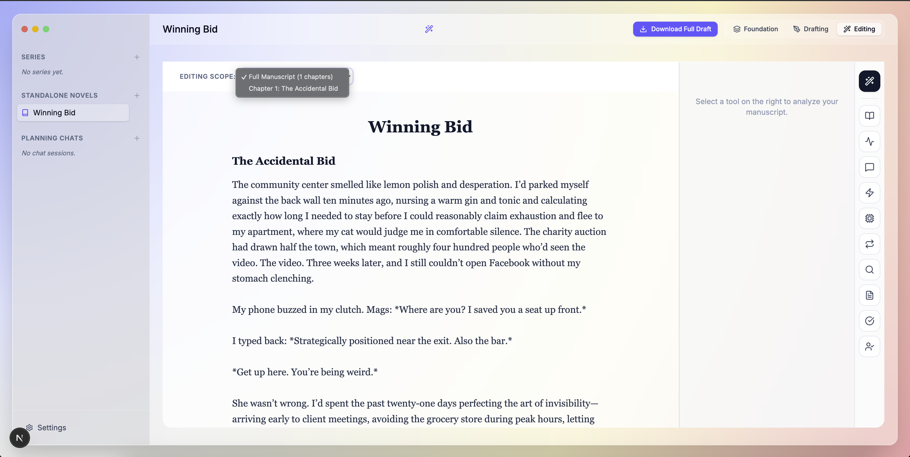
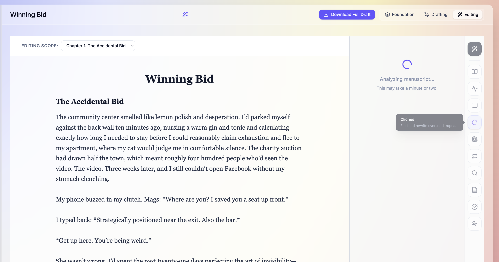
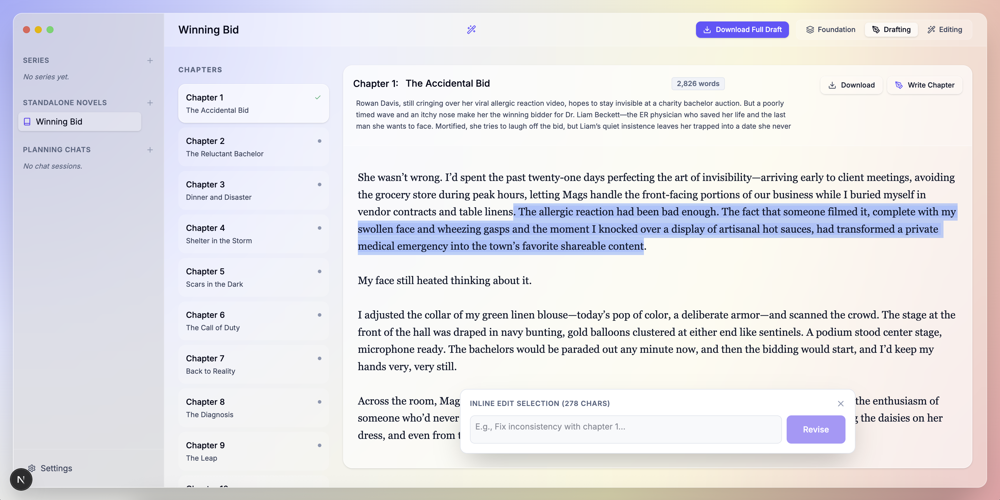
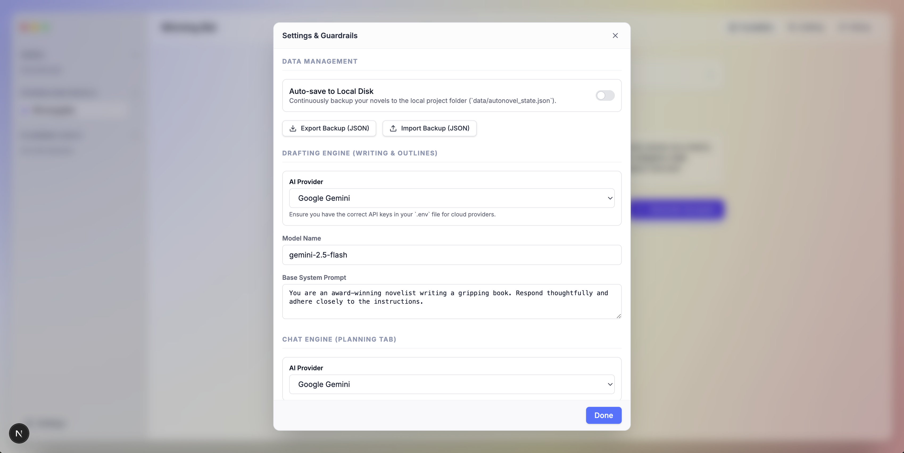
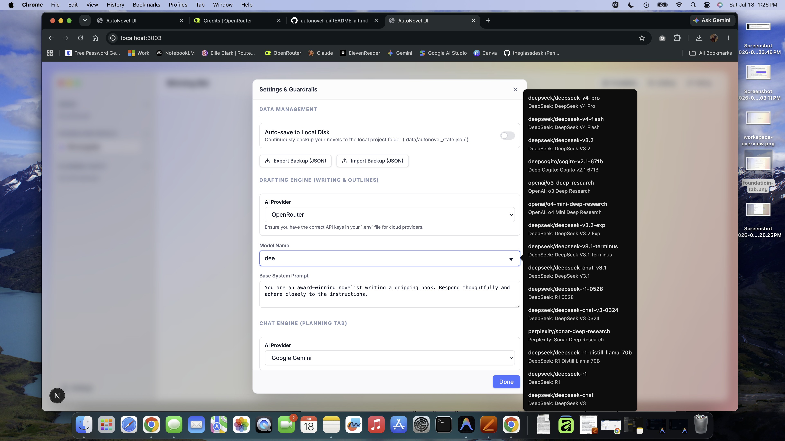

# AutoNovel UI — Workspace Guide

AutoNovel UI is a streamlined desktop-style interface for local and cloud novel generation pipelines. It enables authors to construct commercial-grade fiction from premise to final prose by managing outlines, worldbuilding bibles, character files, and chapter drafts, with robust guardrails to prevent "AI slop."

---

## Workspace Overview



> 📹 **Video Demo**: View the screen recording in [docs/images/cast-recording.mov](docs/images/cast-recording.mov).

---

## Core Features & Workflow

The application divides the creative process into three distinct tabs: **Foundation**, **Drafting**, and **Editing**.

### 1. The Foundation Tab
The Foundation tab is the "story bible" where you establish the core facts and guidelines for your project.

* **Book Settings**:
  * **System Prompt Override**: Provide customized direction for the drafting model.
  * **Story So Far / Established Facts**: Maintain a running list of lore, facts, and events already shown to the reader. The engine refers to this to avoid repeating reveals or re-introducing characters.
  * **Reserved Locations / Objects**: Declare specific elements locked until future chapters (e.g. *"the Relay Core chamber"*). This keeps the model from rushing ahead geographically.
  * **Sample Prose (Style DNA)**: Paste a sample of your writing style, voice register, and pacing metrics to serve as the prose standard.
* **Core Development**:
  * **Premise**: Generate a synopsis.
  * **Characters**: Automatically build out 8-10 characters (including protagonistic details, want/need, core lies, and physical descriptions).
  * **Outline**: Build or expand a complete chapter outline table with POV tracking (supporting Dual-POV alternating structures).



---

### 2. The Drafting Tab (2-Step Verification)
Drafting prose is handled in a controlled two-step pipeline to prevent hallucinated plots and geographical drift.

* **Step 1: Pre-Draft Beat Check**:
  * Clicking **"Write Chapter"** opens the **Pre-Draft Beats Verification** dialog.
  * The model generates a list of sequential bullet beats for the chapter and explicitly confirms whether they overlap with forbidden boundaries (the next 3 chapters or reserved locations).
  * You can review and edit these beats directly.
* **Step 2: Generate Chapter Prose**:
  * Once approved, the model writes the chapter prose by strictly expanding on your beats list, adhering to the Length Policy (2,500–3,500 words) and Content Discipline rules.





---

### 3. The Editing Tab
The Editing tab hosts the copyediting, line-editing, and formatting tools.

* **Selected Prose Highlight / Inline Edit**: Highlight any sentence or paragraph in the editor to request inline changes or rewrites.
* **Manuscript Analysis**: Run analytical checks on pacing, dialogue, readability, repetitiveness, or check style matching against your Sample Prose.







---

## Writing Guardrails

This app includes built-in "Writing Guardrails" designed to prevent local (and cloud) models from generating "AI slop." You can configure these in the Settings menu:

* **CRAFT.md Rules**: High-level instructions for good prose (Show don't tell, grounded descriptions).
* **ANTI-SLOP.md**: A list of banned, overused AI words (tapestry, testament, delve).
* **ANTI-PATTERNS.md**: Structural elements to avoid (neat wrap-ups, rhetorical questions at chapter ends).

These instructions act as an "immune system" during the drafting phase to ensure higher-quality output.

---

## Getting Started

### 1. Installation
Clone the repository, install dependencies, and start the development server:

```bash
# Clone the repository
git clone https://github.com/theglassdesk/autonovel-ui.git
cd autonovel-ui

# Install dependencies
npm install

# Setup environment variables
cp .env.example .env

# Run local server
npm run dev
```
Open `http://localhost:3001` in your browser.

### 2. Configuration for Cloud API Models
If you want to run cloud-based models (e.g. Google Gemini, Anthropic Claude, OpenRouter):

1. Open your `.env` file in the root directory.
2. Add your provider's API key (e.g., `GEMINI_API_KEY=your_key_here`).
3. Save the file and restart the development server.
4. Access the settings gear icon in the bottom-left corner of the app.
5. In the settings modal, select the provider (e.g., `gemini`, `anthropic`, `openrouter`) for **Drafting**, **Chat**, and **Editing** models.
6. Specify the desired model name by highlighting the model and typing the one you want (e.g., `gemini-2.5-flash`).

### 3. Configuration for Local Models
If you want to run completely local models (e.g. Llama-3, Mistral) via LM Studio or Ollama:

1. Start your local inference server (e.g., LM Studio).
2. Enable **CORS** in your local server settings.
3. Access the settings gear icon in the bottom-left corner of the app.
4. Set the API endpoint url to `http://127.0.0.1:1234/v1` (using the IP address avoids browser-level mixed-content blocks).
5. Specify the model name.




